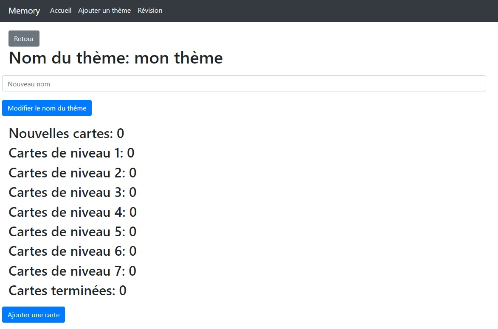

# memory

## Déploiement du projet:

Voici les commandes à effectuer:

```bash
npm install
```

Pour lancer l'application en développement
```bash
npm run serve
```

Ensuite, avec son navigateur préféré, se rendre sur [localhost:8080](http://localhost:8080/)

Pour déployer l'application en production sur Firebase
```bash
npm run build
```
```bash
npm install -g firebase-tools
```
```bash
firebase login
```
```bash
firebase init
```
```bash
firebase deploy
```

Ensuite, avec son navigateur préféré, se rendre sur [Firebase](https://rmathey-memory.web.app/)

## Fonctionnalités implémentées:

- Ajout et suppression de thèmes. Pour ajouter un thème, il suffit de se rendre sur l'onglet "Ajouter un thème" et compléter le formulaire. 
Pour la suppression, il faut se rendre sur l'accueil et cliquer sur le bouton "Supprimer" à côté du thème.

- Ajout de cartes de révisions pour chaque thème, chaque carte est composée d'un recto et d'un verso composés de texte. Pour ajouter une ou plusieurs cartes, il faut se rendre sur l'accueil et cliquer sur le bouton "Modifier" (voir ci-dessus), puis sur le bouton "Ajouter une carte",                                                

puis remplir le formulaire.
- Modification du nom du thème en remplissant le nouveau nom puis en cliquant sur "Modifier le nom du thème" (voir ci-dessus).

- Réviser les cartes en sélectionnant un ou plusieurs thèmes et pour chaque thème choisir le nombre de niveaux et le nombre de nouvelles cartes. Il y a une vérification au niveau de la sélection: l'utilisateur ne peut pas sélectionner plus de cartes et plus de niveaux qui n'ont pas au moins une carte. Durant la révision, l'utilisateur doit se souvenir du verso de la carte, une fois toutes les cartes parcourues, les résultats sont enregistrés. Si la réponse de la carte est bonne, son niveau augmente d'un, sinon son niveau tombe à 1.


- Visualiser le nombre de nouvelles cartes, de cartes mémorisées et le nombre de cartes à chaque niveau.

- La demande d'autorisation des notifications a été implémentée mais pas le système de notification.

- Il y a un mode hors connexion, lorsque la connexion est interrompue, l'utilisateur est redirigé vers une page indiquant qu'il est déconnecté.                                                                                        


## Organisation de votre code et des composants

- Utilisation d'un router pour pouvoir naviguer entre les pages.
- L'utilisation de 2 stores Penia: un pour le stockage de l'état des thèmes et des cartes et un autre pour stocker les cartes et les réponses lors de la révision des cartes.
- L'utilisation de Bootstrap pour rendre le site responsive.
- Afin de pouvoir stocker les thèmes et les cartes lorsque l'utilisateur ferme le navigateur, le local storage est utilisé.
- Toutes les données sont stockées au format JSON.