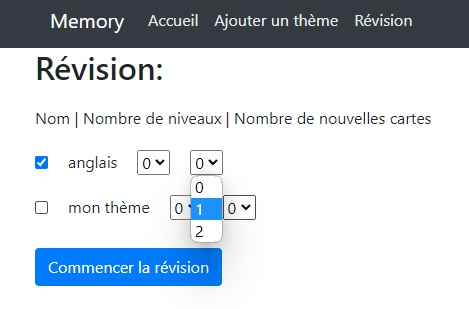
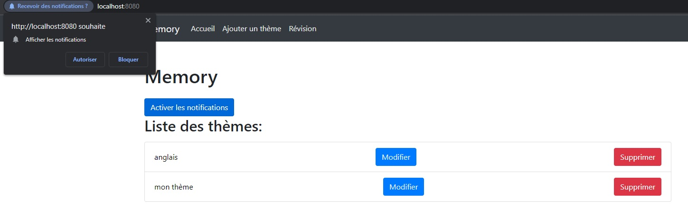

# memory

## Déploiement du projet:

Voici les commandes à effectuer:

```bash
npm install
```
```bash
npm run serve
```

Ensuite, avec son navigateur préféré, se rendre sur [localhost:8080](http://localhost:8080/)

## Fonctionnalités implémentées:

- Ajout et suppression de thèmes. Pour ajouter un thème, il suffit de se rendre sur l'onglet "Ajouter un thème" et complèter le formulaire. 
Pour la suppression, il faut se rendre sur l'acceuil et cliquer sur le bouton "Supprimer" à côté du thème.

- Ajout de cartes de révisions pour chaque thèmes, chaque carte est composé d'un recto et d'un verso composés de texte. Pour ajouter une ou plusieurs cartes, il faut se rendre sur l'acceuil et cliquer sur le bouton "Modifier" (voir ci-dessus), puis sur le bouton "Ajouter une carte",

puis remplir le formulaire.

- Réviser les cartes en sélectionnant un ou plusieurs thèmes et pour chaque thème choisir le nombre de niveaux et le nombre de nouvelles cartes.


- Visualiser le nombre de nouvelles cartes, de cartes mémorisées et le nombre de carte à chaque niveau.

- La demande d'autorisation des notifications a été implémentée mais pas le système de notifications.

- Il y a un mode hors-connexion, lorsque la connexion est interrompue, l'utilisateur est redirigé vers une page indiquant qu'il est déconnecté.
